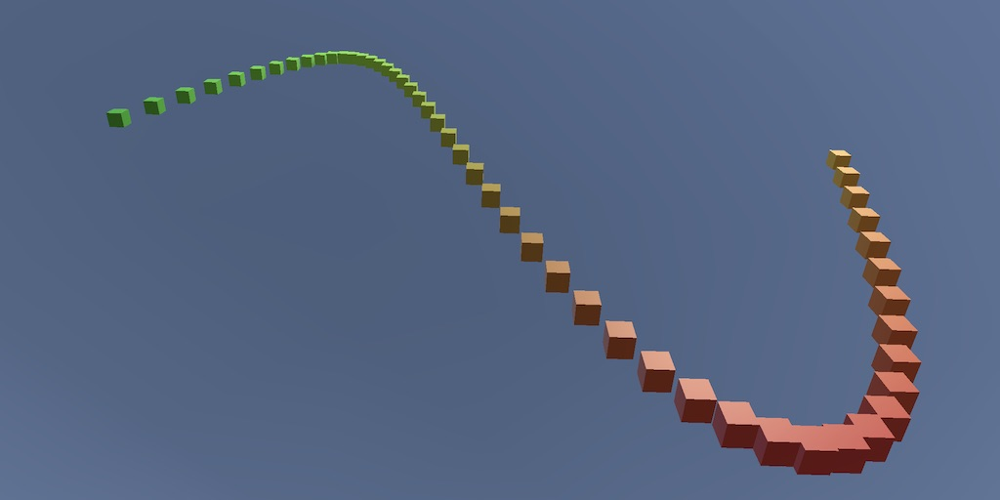

# Graphing

---
## Overview

This project visualizes mathematical functions in Unity, creating a dynamic graph. It demonstrates basic principles of game object manipulation, prefab instantiation, and animation within the Unity environment. Based on the tutorial "Building a Graph" by Catlike Coding.

## Features

- Uses Unity's default cube game object to represent points on the graph.
- Dynamically generates a line of cubes to visualize mathematical functions.
- Allows for the animation of the graph to show time-dependent functions.

## How to Use

Adjust the `Graph` component parameters in the Unity Inspector to change the mathematical function and the resolution of the graph. This allows you to explore different functions and their visual representations.

## Acknowledgments

Tutorial provided by [Catlike Coding](https://catlikecoding.com/unity/tutorials/basics/building-a-graph/). This project is a practical application of the concepts taught in the "Building a Graph" tutorial.